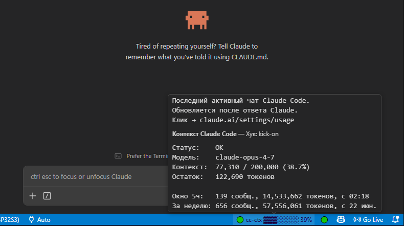

# Claude Limit Meter — описание (RU)



Это перевод [README.md](README.md) с расширенными подробностями.

`Claude Limit Meter` — локальное расширение VS Code, которое показывает
заполнение текущего контекста Claude Code и расход токенов за скользящие
5 часов и текущую неделю в нижней строке состояния VS Code. С версии **0.3.0**
расширение также автоматически устанавливает PostCompact-хук `/kick auto` для
Claude Code — отдельно ставить ничего не нужно.

Расширение работает локально: не вызывает API Anthropic, не требует ключа,
не отправляет содержимое чатов наружу и не управляет Claude. Оно только
читает локальные `.jsonl`-логи сессий Claude Code и показывает индикатор.

---

## Изменения в 0.3.6

- **Процент теперь совпадает с тем, что показывает сам Claude Code.** В
  ранних версиях расширение делило input-токены на «сырое» окно модели
  (200K). Claude Code в своём статус-баре делит на *эффективное* окно
  по формуле `окно_модели − maxOutputTokens − 13 000` (запас под
  auto-compact). Это видно прямо в исходнике webview-сборки Claude Code
  2.1.187, функция `vXe()`. Теперь и наше расширение использует ту же
  формулу: если Claude Code пишет «84% context used — click to compact»,
  наш индикатор тоже покажет 84%, а не 52%.
- Tooltip раскрывает арифметику строкой `Окно: 200 000 модель − 64 000
  ответ − 13 000 запас`, а «Остаток» подписан как расстояние до
  auto-compact, а не до сырого окна модели.
- maxOutputTokens по модели:
  `claude-opus-4-7 / 4-6` → 64K, `claude-sonnet-4-x` → 64K,
  `claude-haiku-4-5` → 64K, `claude-opus-4-0 / 4-1` → 8K, `claude-3-*` → 8K.
  Переопределить можно настройкой `claudeLimitMeter.contextWindowOverride`
  (она задаёт сырое окно модели до вычитаний).

## Изменения в 0.3.5

- **Tooltip больше не моргает при статичном hover.** Текст индикатора, его
  цвет и содержимое tooltip кэшируются и переприсваиваются только когда
  реально что-то поменялось. Дрейфующие метки `HH:MM` и дата в строках
  «Окно 5ч» / «За неделю» исключены из ключа сравнения, чтобы смена минуты
  не вызывала «перестройку» tooltip каждые 60 секунд. `kickItem.show()`
  сделан идемпотентным — раньше его вызов на каждом тике закрывал tooltip
  на соседнем `cc-ctx`.
- **`install.ps1` чистит за собой.** Скрипт удаляет любые старые
  установленные версии расширения перед копированием новой и теперь правит
  запись `local.claude-limit-meter` в `~/.vscode/extensions/extensions.json`.
  После апгрейда версии VS Code больше не показывает предупреждение
  «invalid extension detected».
- **Авточистка при активации как страховка.** При старте расширение само
  удаляет все соседние папки `local.claude-limit-meter-*` с версией ниже
  текущей — на случай, если установка шла не через `install.ps1`.

---

## §1. Для пользователя

### 1.1 Что появляется в status bar

После установки и `Developer: Reload Window` в правой части status bar VS Code
появляются два связанных элемента: индикатор контекста и кружок-индикатор
хука.

```text
🟢 cc-ctx ▓▓▓░░░░░ 42% 🟢
🟡 cc-ctx ▓▓▓▓▓░░░ 69% 🟢
🟠 cc-ctx ▓▓▓▓▓▓▓░ 84% ⚪
🔴 cc-ctx ▓▓▓▓▓▓▓▓ 93% 🟢
```

**Левый элемент (`cc-ctx`)** — основной индикатор давления на контекст:

- цветной кружок состояния: 🟢 OK, 🟡 WARM, 🟠 HIGH, 🔴 CRITICAL;
- префикс `cc-ctx` (claude code context) — чтобы было однозначно понятно,
  что это про Claude Code, а не про какое-то другое окружение;
- текстовая шкала `▓/░` фиксированной длины (по умолчанию 8 символов);
- процент заполнения окна модели последним активным чатом Claude Code.

**Правый элемент** — маленький кружок статуса PostCompact-хука `/kick auto`:

- 🟢 — хук включён, после `/compact` он сам положит готовый handoff в чат;
- ⚪ — хук выключен, после `/compact` никакого автоматического handoff не будет.

Пороги цвета у левого индикатора:

```text
🟢 OK        0–64%    контекст в норме
🟡 WARM      65–79%   контекст заметно заполнен
🟠 HIGH      80–89%   пора планировать handoff в новый чат
🔴 CRITICAL  90%+     близко к авто-compaction / лимиту окна модели
```

Пороги переопределяются настройками `claudeLimitMeter.warnPercent`,
`highPercent`, `criticalPercent`.

### 1.2 Что делает курсор

| Действие | На левом `cc-ctx` | На правом кружке хука |
|---|---|---|
| Наведение (hover) | Показывает общий tooltip с подробностями: модель, контекст, остаток, расход за 5h и за неделю. Шапка tooltip содержит строку `Контекст Claude Code — Хук: kick-on` (или `kick-off`). | Показывает **тот же** tooltip — это один shared markdown-блок, а не отдельное окно. |
| Клик | Открывает `https://claude.ai/settings/usage` в браузере по умолчанию (страница плана и расхода Anthropic). | Переключает PostCompact-хук: ON → OFF → ON. Меняется иконка кружка, изменение применяется мгновенно (через файл-маркер `~/.claude/.kick-disabled`). |

Никаких правых-кликов, drag&drop и контекстных меню расширение не вводит —
только hover и одиночный клик.

### 1.3 Что показывает tooltip

Один и тот же tooltip висит на обоих элементах. Пример содержимого:

```text
Контекст Claude Code — Хук: kick-on

Статус:    WARM
Модель:    claude-opus-4-7
Контекст:  137,432 / 200,000 (68.7%)
Остаток:   62,568 токенов

Окно 5ч:   184 сообщ., 18,553,902 токенов, с 18:55
За неделю: 1,402 сообщ., 142,019,773 токенов, с 22 июн

Последний активный чат Claude Code.
Обновляется после ответа Claude.
Клик → claude.ai/settings/usage
```

- **Шапка** — фиксированная строка с состоянием хука `/kick auto`.
- **Статус** — текстовый дубликат цвета индикатора (OK/WARM/HIGH/CRITICAL).
- **Модель** — `model` из последнего `assistant`-сообщения в JSONL.
- **Контекст** — input + cache_read + cache_create / окно модели.
- **Остаток** — сколько токенов до конца окна модели.
- **Окно 5ч** — сумма сообщений и токенов за скользящие 5 часов; время — момент,
  с которого расширение начало считать это окно.
- **За неделю** — сумма с понедельника 00:00 локального времени.

### 1.4 Команды в Command Palette

`Ctrl+Shift+P`, начать вводить `Claude Limit Meter`:

- `Claude Limit Meter: Toggle Kick Auto-Handoff Hook` — то же, что клик по правому
  кружку.
- `Claude Limit Meter: Reinstall Kick Hook (force overwrite)` — принудительно
  перезаписать все файлы хука (скрипт, слэш-команды, блок в `settings.json`).
- `Claude Limit Meter: Uninstall Kick Hook` — полностью убрать хук:
  удаляются файлы скрипта и слэш-команд, маркеры (`.kick-installed-version`,
  `.kick-disabled`), лог (`.kick-log`) и блок `hooks.PostCompact` из
  `~/.claude/settings.json`. Остальные ключи `settings.json` не трогаются.

### 1.5 Настройки

VS Code settings (`Ctrl+,`, фильтр `claudeLimitMeter`):

| Настройка | По умолчанию | Что делает |
|---|---|---|
| `updateIntervalSeconds` | 10 | Период опроса JSONL и перерисовки. |
| `barLength` | 8 | Длина текстовой шкалы `▓/░`. |
| `showBar` | true | Скрыть/показать шкалу. |
| `textColor` | "" | Принудительный цвет текста индикатора (пусто = по теме). |
| `warnPercent` | 65 | Порог перехода в WARM. |
| `highPercent` | 80 | Порог перехода в HIGH. |
| `criticalPercent` | 90 | Порог перехода в CRITICAL. |
| `contextWindowOverride` | 0 | Жёстко задать окно модели (например, 1000000 для Sonnet [1m]). |
| `show5hUsage` | true | Показывать строку «Окно 5ч». |
| `showWeeklyUsage` | true | Показывать строку «За неделю». |
| `scanWindowHours` | 192 | Сколько часов JSONL-истории сканировать для агрегации (8 дней). |
| `statusBarPriority` | 999 | Приоритет в status bar. Чем больше — тем левее. |
| `showKickStatus` | true | Показать/скрыть правый кружок статуса хука. |

### 1.6 Установка

В PowerShell из папки расширения:

```powershell
./install.ps1
```

Затем `Developer: Reload Window` в VS Code. PostCompact-хук `/kick auto`
поставит себя сам при первой активации.

### 1.7 Что устанавливается автоматически вместе с расширением

При первой активации расширение разворачивает PostCompact-хук Claude Code.
Установка идемпотентна: пока маркер `~/.claude/.kick-installed-version`
совпадает с версией расширения, файлы не перезаписываются.

Раскладка:

```text
~/.claude/scripts/kick-hook.js       — тело хука (вывод через systemMessage, токены модели не тратит)
~/.claude/commands/kick.md           — ручная команда: положить handoff в чат
~/.claude/commands/kick-on.md        — включить PostCompact auto-handoff
~/.claude/commands/kick-off.md       — выключить PostCompact auto-handoff
~/.claude/settings.json              — в hooks.PostCompact добавляется запись на kick-hook.js
~/.claude/.kick-installed-version    — маркер версии установленного хука
```

Toggle-маркер и лог:

```text
~/.claude/.kick-disabled             — файл есть = хук OFF, нет = ON
~/.claude/.kick-log                  — последние 50 срабатываний, ротация ~4 KB
```

### 1.8 Ограничения

- Левый индикатор обновляется только после нового `assistant`-сообщения в JSONL,
  то есть после очередного ответа Claude. До первого ответа в свежей сессии
  будет `cc-ctx ?`.
- Размер окна модели не приходит в JSONL — берётся из встроенной таблицы по
  имени модели (`claude-opus-4-*`, `claude-sonnet-4-*`, `claude-haiku-4-*` →
  200 000; имя содержит `[1m]` → 1 000 000). Для новых моделей переопределяется
  через `claudeLimitMeter.contextWindowOverride`.
- Claude Code **не пишет** в JSONL rate-limit-headers плана Anthropic. Поэтому
  «5h использовано %» и «weekly использовано %» расширение не показывает —
  только сырые суммы сообщений и токенов. Сравнение с лимитом плана
  (Pro / Max 5x / Max 20x / API) делает пользователь.
- Если открыто несколько чатов Claude Code одновременно, индикатор показывает
  тот, у которого самое свежее `assistant`-сообщение.
- 5h-окно у Anthropic стартует от первого сообщения в блоке, а не «сейчас минус
  5 часов». Расширение использует приближение `now − 5h` — близко по смыслу,
  но не идентично официальной биллинговой логике.

---

## §2. Под капотом

### 2.1 Структура файлов в репозитории

```text
package.json     — манифест VS Code extension, объявляет команды и настройки
extension.js     — вся логика расширения, один файл, без сборки
README.md        — английская версия описания
README_ru.md     — этот документ
install.ps1      — копирует package.json, extension.js, README.md, resources/
                   в %USERPROFILE%\.vscode\extensions\local.claude-limit-meter-<ver>\
resources/       — файлы, которые расширение разворачивает в ~/.claude/
  kick-hook.js
  kick.md
  kick-on.md
  kick-off.md
.vscodeignore    — что не попадает в .vsix
```

### 2.2 Источник данных

Локальные `.jsonl`-логи Claude Code:

```text
%USERPROFILE%\.claude\projects\<encoded-cwd>\<session-uuid>.jsonl
```

Каждое `assistant`-сообщение содержит объект `usage`:

```json
{
  "type": "assistant",
  "timestamp": "...",
  "message": {
    "id": "msg_...",
    "model": "claude-opus-4-7",
    "usage": {
      "input_tokens": 1,
      "cache_creation_input_tokens": 1783,
      "cache_read_input_tokens": 41453,
      "output_tokens": 202
    }
  }
}
```

Путь к корню можно переопределить переменной окружения `CLAUDE_HOME`.

### 2.3 Цикл обновления

При запуске VS Code расширение активируется по `onStartupFinished` и создаёт
два `StatusBarItem` (`Alignment.Right`) с приоритетами `priority` и
`priority - 1`. У status bar справа более высокий приоритет = более левая
позиция, поэтому `cc-ctx` оказывается слева от кружка хука. Раз в
`updateIntervalSeconds` (по умолчанию 10) выполняется полный цикл:
поиск активного чата → расчёт давления → агрегация 5h/недели → рендер
текста и tooltip → проверка состояния `.kick-disabled` → рендер правого
кружка.

### 2.4 Поиск активного чата

1. Открывается папка `%USERPROFILE%\.claude\projects` (или `$CLAUDE_HOME\projects`).
2. Рекурсивно собираются все `.jsonl` файлы.
3. Сортировка по `mtime`, берутся до 40 самых свежих.
4. В каждом читается только хвост (примерно последние `768 KB`).
5. Среди прочитанных строк ищется **последняя** с `"type": "assistant"` и
   непустым `message.usage`.
6. Из неё берутся `model`, `usage.*`, `timestamp` для рендера индикатора и
   tooltip.

### 2.5 Расчёт давления на контекст

```text
context_tokens = input_tokens + cache_creation_input_tokens + cache_read_input_tokens
window         = 200_000           # все актуальные Claude 4.x/3.x
                 1_000_000         # если в имени модели есть [1m] (Sonnet extended)
pressure       = context_tokens / window * 100
left           = window - context_tokens
```

Принудительное окно: `claudeLimitMeter.contextWindowOverride`.

### 2.6 Агрегация 5h и недели

Дополнительно проходом по сессионным файлам, изменённым за последние
`scanWindowHours` (по умолчанию 192 = 8 дней), собираются все `assistant`-сообщения
с `usage`. Дедупликация по `message.id` — Claude Code иногда дублирует строки в
JSONL, без дедупа сумма раздуется. Для каждой строки складываются:

- `input_tokens`
- `output_tokens`
- `cache_creation_input_tokens + cache_read_input_tokens`

Получаются два набора сумм:

- **5h rolling block** — всё, что попало в `[now − 5h, now]`.
- **Weekly** — всё, что попало в `[понедельник 00:00 локального времени, now]`.

### 2.7 Установщик kick-хука

`ensureKickArtifacts({ force })` вызывается при активации:

1. Читается маркер `~/.claude/.kick-installed-version`.
2. Если маркер совпадает с `package.json#version` и `force=false` — выходим, ничего
   не трогаем.
3. Иначе: создаются `~/.claude/scripts/` и `~/.claude/commands/` если нужно;
   копируются 4 файла из `resources/`:

   ```text
   resources/kick-hook.js → ~/.claude/scripts/kick-hook.js
   resources/kick.md      → ~/.claude/commands/kick.md
   resources/kick-on.md   → ~/.claude/commands/kick-on.md
   resources/kick-off.md  → ~/.claude/commands/kick-off.md
   ```

4. Вызывается `patchSettingsJsonForKick(settingsPath, scriptPath)`.
5. В маркер записывается текущая версия расширения.

`uninstallKickArtifacts()` делает обратное: удаляет файлы, маркеры (`.kick-installed-version`,
`.kick-disabled`), лог `.kick-log` и блок `hooks.PostCompact` из `settings.json`.

### 2.8 Merge `settings.json`

Самая хрупкая часть, поэтому сделана аккуратно:

- читается существующий `~/.claude/settings.json`;
- парсится с сохранением **всех** ключей (`permissions`, `model`, `effortLevel`,
  `env`, `mcpServers`, что угодно), включая нестандартные;
- проверяется `hooks.PostCompact`: если уже есть запись на `kick-hook.js` —
  ничего не делаем; иначе добавляем запись:

  ```json
  {
    "hooks": {
      "PostCompact": [
        {
          "hooks": [
            { "type": "command", "command": "node \"<абсолютный путь>\\kick-hook.js\"" }
          ]
        }
      ]
    }
  }
  ```

- атомарная запись (запись во временный файл, потом rename).

Никаких остальных ключей merge не трогает.

### 2.9 Сам хук `kick-hook.js`

Что делает скрипт:

1. Читает stdin (JSON, который Claude Code передаёт PostCompact-хуку).
2. Проверяет файл-маркер `~/.claude/.kick-disabled` — если есть, выходит молча.
3. Формирует короткий handoff-блок и печатает его в stdout как
   `systemMessage` JSON-ответ (Claude Code положит его в чат как системное
   сообщение, токены модели **не тратятся** на этот вывод).
4. Логирует строку с timestamp в `~/.claude/.kick-log`, держа в файле только
   последние 50 строк (read → append → split → `slice(-50)` → write).
   Размер лога ограничен ~4 KB, никакого внешнего logrotate не нужно.

Stop-каналы (всё прозрачно для пользователя):

- `~/.claude/.kick-disabled` — мгновенный toggle, не требует перезагрузки
  настроек VS Code или Claude Code;
- `settings.json hooks.PostCompact` — глобальный on/off;
- удаление маркера версии вызовет переустановку при следующей активации
  расширения.

### 2.10 Что НЕ читается

Расширение **не** парсит текст пользовательских и ассистентских сообщений ради
анализа содержимого. Из строк JSONL ему нужны только технические поля:
`type`, `timestamp`, `message.id`, `message.model`, `message.usage`. Текст
запросов и ответов не читается, не хранится, никуда не отправляется.

### 2.11 Почему не через Anthropic API

- расширение не клиент модели, оно не может корректно реконструировать реальный
  prompt Claude Code (системные инструкции, контекст инструментов, скрытые
  служебные части);
- Anthropic API возвращает usage только для собственных вызовов клиента, а не
  для чужой сессии Claude Code;
- работа без ключа намного безопаснее: ни секретов, ни сетевых запросов, ни
  отправок чатов наружу;
- локальные JSONL уже содержат фактические значения
  `input/cache_read/cache_create/output_tokens`, которые Claude Code записал
  после реального ответа модели — это то же число, которое увидел бы API.
