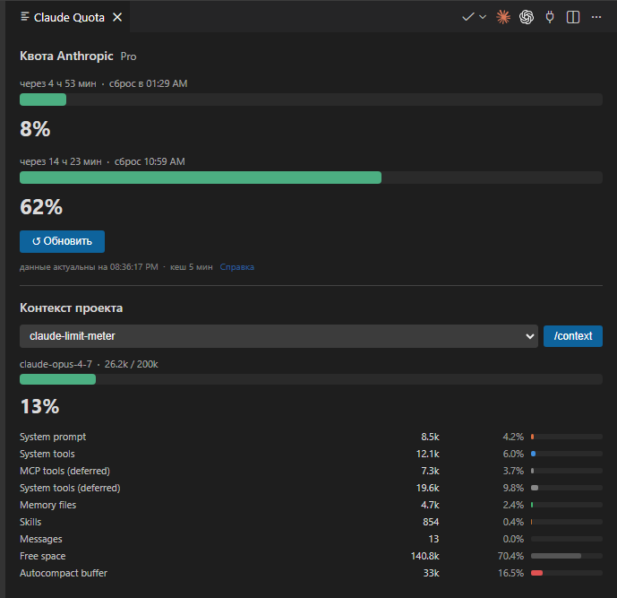
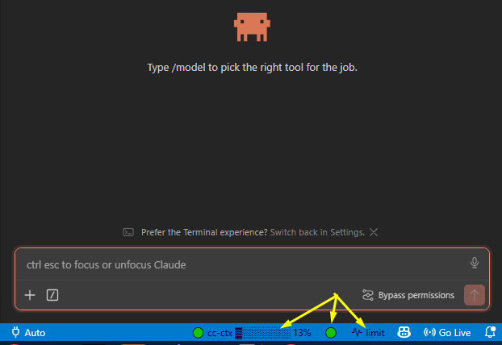

# Claude Limit Meter

[Скачать VSIX v0.4.1](https://github.com/cleverplant/claude-limit-meter/releases/download/v0.4.1/claude-limit-meter-0.4.1.vsix) · [Описание релиза](https://github.com/cleverplant/claude-limit-meter/releases/tag/v0.4.1) · [English version](README.md)





> **Важно про источник данных.** Расширение читает всё из **CLI-версии
> Claude Code** (терминальной) — из её лога сессий в
> `~/.claude/projects/` и из OAuth-кредов в `~/.claude/.credentials.json`.
> Оно **не** общается с графической панелью «Claude Code for VS Code» и
> не имеет доступа к её состоянию в памяти. Поэтому блок `/context`
> внутри web-панели Quota может показывать другую модель или другую
> разбивку токенов, чем GUI-панель Claude Code для того же проекта: CLI
> запускает новую короткую сессию, чтобы выполнить `/context`, а GUI
> показывает живую сессию, которая у него открыта. А вот цифры квоты
> 5ч / 7 дней приходят с аккаунта Anthropic и всегда совпадают между
> CLI и GUI.

---

## Для пользователя

Что расширение добавляет в VS Code и как этим пользоваться каждый день.

### Три элемента в статус-баре

Слева направо в правом нижнем углу VS Code:

1. **`cc-ctx ▓▓▓▓▓░░░ 13%`** — индикатор заполнения контекста для
   последнего активного чата Claude Code. Процент совпадает с тем,
   что показывает сам Claude Code внутри своего диалога `/context`.
   Цвет полоски меняется по мере роста нагрузки:

   ```
   🟢 зелёный    0–64%    OK
   🟡 жёлтый     65–79%   warm
   🟠 оранжевый  80–89%   high
   🔴 красный    90%+     критично, auto-compact близко
   ```

2. **Кружок `🟢` / `⚪`** — индикатор хука `/kick auto`: зелёный, когда
   PostCompact-хук включён, белый — когда выключен. Клик переключает.

3. **`limit`** — открывает web-панель **Claude Quota** (см. ниже).
   Показывает реальный расход 5ч и 7 дней против вашего тарифа
   Anthropic.

### Панель Quota (по клику `limit`)

Панель открывается во вкладке редактора и состоит из трёх блоков:

- **Квота Anthropic** — скользящий 5-часовой блок и 7-дневный расход в
  процентах, время до сброса каждого окна и значок тарифа
  (`Pro` / `Max` / `Free`). Цифры приходят с серверов Anthropic через
  тот же эндпоинт, что использует официальное приложение Claude Code.
  Кешируются локально на 5 минут — повторный клик на `limit` возвращает
  кешированные данные; кнопка `↺ Обновить` принудительно перезапрашивает.
- **Контекст проекта (`/context`)** — выберите папку рабочей области
  из выпадающего списка и нажмите `/context`. Расширение запускает CLI
  Claude Code в этой директории и показывает разобранный ответ: имя
  модели, общий расход контекста и разбивку по категориям (System prompt,
  Memory files, Skills, Messages и т. д.).
- **Ссылка «Справка»**, объясняющая 5-минутный кеш.

> ⚠️ Блок `/context` запускает CLI-под-сессию, а **не** вашу живую
> сессию Claude Code в VS Code. Модель и проценты могут отличаться от
> того, что показывает GUI-панель — см. предупреждение в самом верху.

### Хук `/kick` для handoff после auto-compact

Расширение автоматически устанавливает в Claude Code маленький хук,
который помогает пережить auto-compact без потери ориентации.

**Какую проблему решает.** Когда чат Claude Code заполняется примерно
до 91%, он делает auto-compact: видимая история сворачивается в саммари,
и реальный диалог, в котором вы работали, больше нельзя удобно
перематывать. Нельзя даже найти `Ctrl+F` — нужного сообщения на экране
просто нет.

**Что делает хук.** Сразу после каждого auto-compact (или по команде
`/kick`) хук вставляет в чат **готовый к копированию блок handoff** как
системное сообщение. Блок содержит:

- текущую git-ветку, последний коммит, состояние рабочего дерева;
- активный этап из `plans/plan.md` (если в проекте такой есть) и
  ближайший невыполненный шаг `[ ]`;
- если во время compact Claude Code записал структурированное саммари,
  оно встраивается «как есть».

Вы копируете блок, открываете новый чат, вставляете — и сразу
сориентированы. Вывод хука идёт через канал `systemMessage` — **на него
не тратятся токены модели.**

**Слэш-команды, доступные в любом чате Claude Code:**

- `/kick` — ручной handoff прямо сейчас (используйте до 91%, чтобы
  заранее переехать в новый чат).
- `/kick-on` — включить PostCompact-авто-handoff.
- `/kick-off` — выключить (хук остаётся установлен, но тихо выходит
  при срабатывании).

**Три независимых способа проверить, что хук жив:**

1. **Кружок в статус-баре** — зелёный = ON, белый = OFF.
2. **После `/compact`** — в чате появляется системное сообщение,
   начинающееся с `🔄 /kick auto (PostCompact) — handoff готов:`.
3. **Лог срабатываний** — откройте `~/.claude/.kick-log`; каждое успешное
   срабатывание добавляет одну строку. Лог авто-обрезается до последних
   50 записей.

Рабочий рецепт, когда контекст близок к лимиту: сначала `/compact`,
**потом** `/kick`. Compact запишет в JSONL структурированное саммари, и
`/kick` его встроит в handoff-блок.

### Установка

Из папки проекта в PowerShell:

```powershell
./install.ps1
```

Затем в VS Code — **`Developer: Reload Window`**. Хук установится сам
при первой активации.

### Удаление (два правильных варианта)

Просто удалить `.vsix` **недостаточно**: VS Code не вызывает
`deactivate()` при удалении расширения, поэтому файлы, которые оно
записало в `~/.claude/`, останутся на диске, пока вы их явно не уберёте.
Выберите режим:

**Вариант A — оставить рабочий хук, убрать только статус-бар.**
1. `Extensions → Claude Limit Meter → Uninstall`.
2. `Developer: Reload Window`.

Что теряете: три элемента в статус-баре. Что остаётся: команды `/kick`,
`/kick-on`, `/kick-off`, PostCompact-авто-handoff, лог срабатываний.

**Вариант B — полная чистка.**
1. Command Palette → `Claude Limit Meter: Uninstall Kick Hook`.
2. `Extensions → Claude Limit Meter → Uninstall`.
3. `Developer: Reload Window`.

Порядок важен. Если сначала удалить `.vsix`, команда из шага 1 исчезнет
из палитры — см. «Ручная чистка» в техническом разделе ниже.

**Удаление через агента.** Для Codex / Claude Code в проекте лежат
готовые промпты под оба варианта:
[prompts/uninstall-full.md](prompts/uninstall-full.md) и
[prompts/uninstall-vsix-only.md](prompts/uninstall-vsix-only.md).

---

## Техническая часть

Как это устроено внутри и где живут данные.

### Источники данных

Три независимых входа:

| Блок | Источник | API-вызов? |
|---|---|---|
| `cc-ctx %` и tooltip при наведении | Локальный JSONL: `~/.claude/projects/<encoded-cwd>/*.jsonl` | Нет |
| Квота 5ч / 7д в панели | `GET https://api.anthropic.com/api/oauth/usage` с OAuth-токеном из `~/.claude/.credentials.json` | Да (Anthropic) |
| Значок тарифа (`Pro` / `Max`) | `GET https://api.anthropic.com/api/oauth/profile` (тот же токен) | Да (Anthropic) |
| Блок `/context` | Запускает `C:\Tools\claude-wrap.exe` в выбранной папке проекта, шлёт `/context` в stdin, парсит markdown-ответ | Косвенно — через CLI |

Расширение не отправляет содержимое чатов наружу, не читает тела
сообщений и не требует от вас вводить API-ключ. OAuth-токен — это тот
же токен, который уже использует CLI.

### Формула процента контекста

Для каждого assistant-сообщения в JSONL:

```text
context_tokens   = input_tokens + cache_creation_input_tokens + cache_read_input_tokens
effective_window = окно_модели − max_output_tokens − 13 000   # запас под auto-compact
percent          = context_tokens / effective_window × 100
```

Это совпадает с тем, что показывает Claude Code внутри своего диалога
`/context` (сверено с функцией `vXe()` в webview-сборке Claude Code
2.1.187). `max_output_tokens` по модели: 64K для `claude-opus-4-7`,
`claude-opus-4-6`, `claude-sonnet-4-x`, `claude-haiku-4-5`;
8K для `claude-opus-4-0`, `claude-opus-4-1`, `claude-3-*`.

### Определение окна контекста

В порядке приоритета:

1. Настройка `claudeLimitMeter.contextWindowOverride` (ручной override).
2. Имя модели в JSONL содержит `[1m]` (редко — CLI его срезает).
3. `<chatCwd>/.claude/settings.json#model` содержит `[1m]`
   (project-level 1M-beta).
4. `~/.claude/settings.json#model` содержит `[1m]` (глобальный 1M-beta).
5. Fallback: **200 000 токенов** для любого семейства `claude-*`.

### Все настройки

```text
claudeLimitMeter.updateIntervalSeconds      # как часто пересканировать JSONL
claudeLimitMeter.barLength                  # длина полоски cc-ctx в символах
claudeLimitMeter.showBar                    # показывать цветную полоску
claudeLimitMeter.textColor                  # цвет текста в статус-баре
claudeLimitMeter.warnPercent                # порог жёлтого (по умолч. 65)
claudeLimitMeter.highPercent                # порог оранжевого (по умолч. 80)
claudeLimitMeter.criticalPercent            # порог красного (по умолч. 90)
claudeLimitMeter.contextWindowOverride      # принудительный размер окна
claudeLimitMeter.show5hUsage                # блок 5ч в tooltip
claudeLimitMeter.showWeeklyUsage            # блок недели в tooltip
claudeLimitMeter.scanWindowHours            # на сколько часов назад сканировать
claudeLimitMeter.statusBarPriority          # позиция cc-ctx
claudeLimitMeter.usagePageUrl               # URL по клику на cc-ctx
claudeLimitMeter.showKickStatus             # показывать кружок хука
```

### Позиция в статус-баре

`statusBarPriority` (по умолчанию `999`) — приоритет элемента cc-ctx в
правом кластере. Больше = ЛЕВЕЕ. Кружок хука сидит на `priority − 1`,
кнопка limit — на `priority − 2`, поэтому визуальный порядок всегда
`cc-ctx | kick | limit`.

### Хук /kick — какие файлы разворачиваются

При первой активации расширение записывает (идемпотентно, отслеживается
через `~/.claude/.kick-installed-version`):

```text
~/.claude/scripts/kick-hook.js          — тело хука (только systemMessage, не тратит токены)
~/.claude/commands/kick.md              — слэш-команда: ручной handoff
~/.claude/commands/kick-on.md           — слэш-команда: включить авто
~/.claude/commands/kick-off.md          — слэш-команда: выключить авто
~/.claude/settings.json                 — запись hooks.PostCompact (merge, не перезапись)
```

Файлы состояния:

```text
~/.claude/.kick-installed-version       — версия текущего развёрнутого хука
~/.claude/.kick-disabled                — маркер переключения: есть = OFF, нет = ON
~/.claude/.kick-log                     — последние 50 срабатываний, авто-ротация
```

### Команды Command Palette

```text
Claude Limit Meter: Refresh
Claude Limit Meter: Toggle Bar View
Claude Limit Meter: Open Usage Page (claude.ai)
Claude Limit Meter: Show Quota Limits
Claude Limit Meter: Toggle Kick Auto-Handoff Hook
Claude Limit Meter: Reinstall Kick Hook (force overwrite)
Claude Limit Meter: Uninstall Kick Hook
```

### Ручная чистка (если `.vsix` уже удалён)

Удалить файлы:

```text
~/.claude/scripts/kick-hook.js
~/.claude/commands/kick.md
~/.claude/commands/kick-on.md
~/.claude/commands/kick-off.md
~/.claude/.kick-installed-version
~/.claude/.kick-disabled                (если есть)
~/.claude/.kick-log                     (если есть)
```

Затем открыть `~/.claude/settings.json` и убрать из `hooks.PostCompact`
запись, у которой `command` содержит `kick-hook.js`. Если массив
`PostCompact` стал пустым — удалить ключ `PostCompact`. Если объект
`hooks` стал пустым — удалить ключ `hooks`. Все остальные ключи
(`permissions`, `model`, `env`, `mcpServers`, …) трогать запрещено.

### Почему лимиты — реальная квота, а не подсчёт токенов локально

Ранние версии пытались агрегировать расход токенов локально по JSONL,
чтобы оценить блоки 5ч и неделю. Эта цифра всегда была неточной:
Claude Code не сохраняет в логах rate-limit-заголовки Anthropic, а сами
лимиты тарифа сильно отличаются между Pro / Max 5× / Max 20× / API.
Начиная с v0.4.0 панель использует тот же эндпоинт, что и официальное
приложение Claude Code — `/api/oauth/usage` — и показывает реальные
проценты и время сброса. 5-минутный кеш страхует от лишних запросов.
